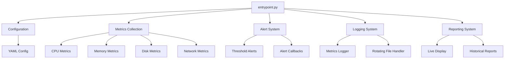

# Server Health Monitoring CLI Tool

A command-line interface (CLI) tool for monitoring server health metrics such as CPU usage, memory consumption, disk space, and network activity.


## Project Architecture



## Project Structure

```
server-health-monitor/
├── server_health_monitor/          # Main package directory
│   ├── __init__.py                # Package initialization
│   ├── entrypoint.py              # Main entry point and CLI interface
│   ├── metrics/                   # System metrics collection
│   │   ├── __init__.py
│   │   ├── cpu.py                # CPU usage monitoring
│   │   ├── memory.py             # Memory usage monitoring
│   │   ├── disk.py               # Disk space monitoring
│   │   └── network.py            # Network activity monitoring
│   ├── alerts/                    # Alert system
│   │   ├── __init__.py
│   │   └── threshold.py          # Threshold-based alerts
│   ├── logging/                   # Logging system
│   │   ├── __init__.py
│   │   └── metrics_logger.py     # Metrics logging
│   ├── reporting/                 # Reporting system
│   │   ├── __init__.py
│   │   └── report_generator.py   # Report generation
│   └── utils/                     # Utility functions
│       ├── __init__.py
│       └── formatters.py         # Output formatting
├── config/                        # Configuration files
│   └── default_config.yaml       # Default configuration
├── tests/                         # Test suite
├── setup.py                       # Package installation
└── requirements.txt               # Project dependencies
```

## Component Explanation

### 1. Entry Point (entrypoint.py)
- Main script that ties everything together
- Handles command-line arguments
- Initializes all components
- Manages the monitoring loop

### 2. Metrics Collection
- **CPU Metrics (cpu.py)**: Monitors CPU usage, core count, and frequency
- **Memory Metrics (memory.py)**: Tracks memory and swap usage
- **Disk Metrics (disk.py)**: Monitors disk space and I/O
- **Network Metrics (network.py)**: Tracks network traffic and errors

### 3. Alert System (alerts/threshold.py)
- Monitors metrics against configurable thresholds
- Generates alerts when thresholds are exceeded
- Supports multiple alert levels (WARNING, CRITICAL)
- Implements callback system for alert handling

### 4. Logging System (logging/metrics_logger.py)
- Logs metrics data for historical analysis
- Uses rotating file handler to manage log size
- Supports different log levels
- Stores data in JSON format

### 5. Reporting System (reporting/report_generator.py)
- Generates real-time metrics display
- Creates historical reports
- Uses Rich library for beautiful terminal output
- Supports live updates

### 6. Configuration (config/default_config.yaml)
- YAML-based configuration
- Defines thresholds for alerts
- Configures monitoring intervals
- Sets up logging parameters

## Key Python Concepts Used

1. **Object-Oriented Programming (OOP)**
   - Classes for each component
   - Inheritance and composition
   - Encapsulation of functionality

2. **Type Hints**
   - Type annotations for better code clarity
   - Static type checking support

3. **Context Managers**
   - `with` statements for resource management
   - Live display handling

4. **Exception Handling**
   - Try-except blocks for error handling
   - Graceful error recovery

5. **Logging**
   - Python's built-in logging system
   - Custom log handlers

6. **Command-Line Interface**
   - Argument parsing with argparse
   - Configuration file handling

7. **Package Management**
   - setuptools for package installation
   - Dependencies management

## How to Extend the Project

1. **Add New Metrics**
   - Create a new class in the metrics directory
   - Implement the get_metrics() method
   - Add configuration options

2. **Custom Alerts**
   - Implement new alert types
   - Add notification methods (email, Slack, etc.)

3. **Enhanced Reporting**
   - Add new report types
   - Implement data visualization
   - Create web dashboard

4. **Remote Monitoring**
   - Add support for remote servers
   - Implement secure communication
   - Add authentication

## Learning Resources

1. **Python Basics**
   - [Python Official Documentation](https://docs.python.org/3/)
   - [Real Python Tutorials](https://realpython.com/)

2. **CLI Development**
   - [Click Documentation](https://click.palletsprojects.com/)
   - [Argparse Tutorial](https://docs.python.org/3/howto/argparse.html)

3. **System Monitoring**
   - [psutil Documentation](https://psutil.readthedocs.io/)
   - [Rich Documentation](https://rich.readthedocs.io/)

4. **Testing**
   - [pytest Documentation](https://docs.pytest.org/)
   - [Python Testing with pytest](https://pythontesting.net/framework/pytest/pytest-introduction/)

## Features

- Real-time monitoring of system metrics
- Configurable threshold alerts
- Historical data logging
- Rich terminal output with color-coded status
- Detailed reporting capabilities

## Installation

1. Clone the repository:
```bash
git clone https://github.com/yourusername/server-health-monitor.git
cd server-health-monitor
```

2. Install dependencies:
```bash
pip3 install -r requirements.txt
```

3. Install the package:
```bash
pip3 install -e .
```

## Usage

### Basic Monitoring

```bash
server-monitor
```

### Custom Configuration

```bash
server-monitor --config path/to/config.yaml
```

### Set Monitoring Interval

```bash
server-monitor --interval 10
```

### Set Log Level

```bash
server-monitor --log-level DEBUG
```

## Configuration

The tool uses a YAML configuration file (`config/default_config.yaml`) with the following structure:

```yaml
cpu:
  warning_threshold: 80
  critical_threshold: 90
  check_interval: 5

memory:
  warning_threshold: 80
  critical_threshold: 90
  check_interval: 5

disk:
  warning_threshold: 80
  critical_threshold: 90
  check_interval: 60
  monitored_partitions: ["/"]

network:
  check_interval: 5
  warning_threshold: 1000
  critical_threshold: 2000

logging:
  level: "INFO"
  file: "server_metrics.log"
  max_size: 10485760
  backup_count: 5
```

## Contributing

1. Fork the repository
2. Create a feature branch
3. Commit your changes
4. Push to the branch
5. Create a Pull Request

## License

This project is licensed under the MIT License - see the LICENSE file for details.
